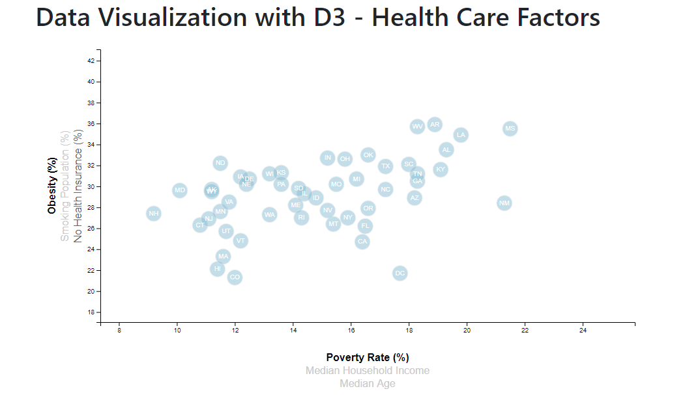

# D3-Challenge - Data Journalism with D3

## Description
This project uses the D3 javascript library to visualize state data about health risk factors (smoking, obesity and uninsurance rates) against socio-economic factors (age, median household income and poverty rate).

The data associated with the visualization can be found in the data.csv file. Because of this, in order to load the data, it is necessary to use the python command python -m http.server to set up an http server in the local host. 

